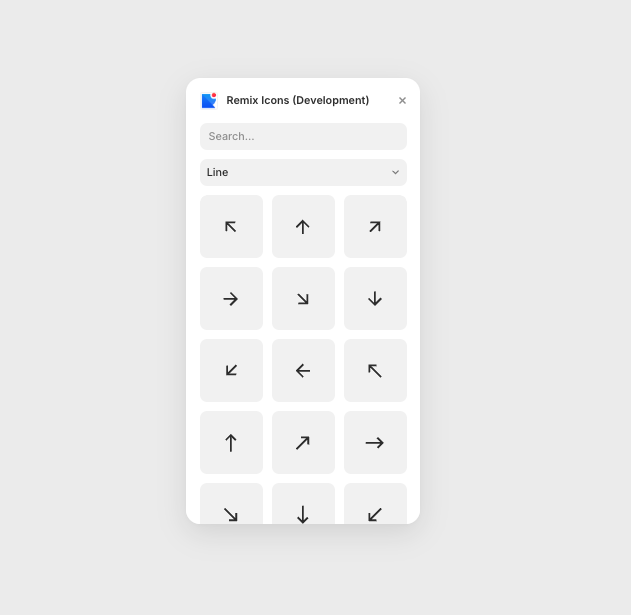

# Remix Icons for Framer

### Overview

As designer I was felting a necissity of using Remix Icons on our Framer project, and if you are designer probably you were feeling too, so we saw the opportunity to develop a plugin that would solve this problem.

So we created a very similar plugin to [Phosphor](https://www.framer.com/marketplace/plugins/phosphor/). 

Many thanks to [Benito](https://github.com/BenitoPedro13) that helped me a lot to built it, many thanks to [Hunter](https://github.com/huntercaron) that created for us the Phoshpor icons plugin, many thanks to all the [Remix Icons](https://remixicon.com/) team and many thanks to Copilot too! 🙏🏽🫡

### Functionatilies 

- Search for tags per icons
- Switch between Line and Fill weights
- Drag and drop icon on canvas 

### Quickstart

`pnpm i` - Install dependencies
`pnpm dev` - Run plugin

For any doubts, check out [Framer plugin docs](https://www.framer.com/developers/plugins/introduction)!

### Contribute

The plugin it's pretty simple and functional, but any problems feel free to send a Pull Request or open an Issue to get this even better!

**By**: [@marcaum-eth](https://github.com/marcaum-eth) & [@benitopedro13](https://github.com/BenitoPedro13)

